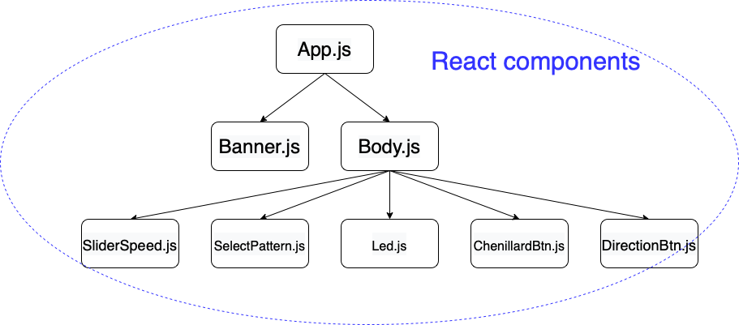

# ResIoT
Le projet a pour objectif de contrôler des LEDS d'une maquette KNX à partir d'un site web afin de reproduire un chenillard (effet de mouvement de la lumière). KNX est un standard de communication utilisé dans la domotique, permettant de contrôler tous types d'objets dans une maison tels que des lumières, des volets et différents types de capteurs. 
Dans ce projet il est possible :    
- D'allumer et éteindre les LEDS individuellement à partir du site web. 
- De lancer et de stopper un chenillard.
- De choisir différents motifs de chenillard.
- De changer le sens du chenillard. 
- De modifier la vitesse du chenillard.
- De contrôler le chenillard à partir des boutons de la maquette KNX.  

## Pré-requis
Le projet nécessite un compteur électrique avec le standard KNX et une passerelle Wi-Fi. De plus, plusieurs LEDS doivent être reliées à ce compteur ainsi que des interrupteurs. La passerelle Wi-Fi et le serveur doivent être reliés sur le même réseau local ou alors sur internet afin de pouvoir communiquer.  

## Installation 
Il est nécessaire de télécharger l'ensemble fichiers du projet. Plusieurs modules devront être à télécharger tel que react, yarn, NodeJs ou encore knx. Pour installer un package et l'ensemble de ses dépendances.

```
npm i <nom du package> 
```

## Lancement du serveur et du site web
Le serveur se lance dans le dossier Serveur par la commande :
```
node server.js
``` 
Le site web s'exécute dans le dossier Client par la commande : 
```
yarn start
```
La page web se trouve par défault sur le localhost port 3000.

## Utilisation du site web
Lorsque vous êtes sur le site web, vous  retrouvez 4 leds, et 4 boutons en dessous des leds. Les boutons permettent d'allumer/éteindre individuellement chaque led. Lorsque le bouton est marqué `start` la led est éteinte, et `stop` lorsqu'elle est allumée. S'il y a une déconnexion avec le serveur, les boutons sont marqués `Disconnected`. 

Le reste des éléments de la page web correspondent au contrôle du chenillard. On retrouve un slider permettant de gérer la vitesse du chenillard en fonction de la valeur de cette dernière que l'on peut régler en faisant glisser la barre, en cliquant dessus ou en changeant la valeur à gauche. 

On retrouve ensuite une liste déroulante permettant de choisir le motif du chenillard. Il est nécessaire d'arrêter et de redémarrer le chenillard pour appliquer le changement de motif. Le démarrage du chenillard par un bouton marqué `Start the Chenillard` lorsqu'il est éteint et `Stop the Chenillard` lorsqu'il est allumé. 

Il reste un dernier bouton, permettant le changement de sens du chenillard, marqué par le sens appliqué sur le chenillard. Il peut être utilisé lorsque le chenillard est en marche.   

## Utilisation de la maquette KNX
Dans ce projet il est possible de commander les leds directement sur la maquette KNX à partir d'interrupteurs. Ils permettent de lancer ou d'arrêter le chenillard, de changer le sens du chenillard, d'accélérer sa vitesse et la ralentir pour le dernier.  

# Architecture du projet
## Architecture Back End
La partie Back end du projet est divisée en trois principaux fichiers: 
- Server.js
- Router.js 
- knx_monitor.js

Le fichier `server.js` permet d'initialiser la communication web socket ainsi que l'api REST en définissant notamment les ports. 

Le fichier `router.js` permet la gestion de la réception des requêtes HTTP du client en même temps de faire le lien avec la maquette KNX. 

Le fichier `knx_monitor.js` permet de contrôler les actions réalisées sur la maquette KNX par une communication IP. Il permet aussi d'envoyer au client les changements d'état notamment des leds par web socket. 

Le fichier `json.js` définit le format des JSON à envoyer au client par web socket.

Le reste des fichiers nous a permis de réaliser différents tests, lorsque nous n'avions pas accès à la maquette, en la simulant. 

## Architecture Front End
L'ensemble des fichiers définissant le front end sont situées dans le dossier `./Client/components`. on retrouve les différents composants React. La figure suivante représente leurs dépendances :

  

Un store Redux est utilisé pour gérer les States. Son implémentatoin est dans le fichier `Store.js`. Cela permet de gérer les états de façon dynamique et permet une mise à jour instantanée de l'UI.

Le fichier `ParserServer.js` s'occupe de récupérer les informations provenant du serveur via une connection WebSocket et de mettre à jour le store en conséquence.

## Auteurs
Le projet a été réalisé dans le cadre du module RESIoT de la deuxième année de l'ESIR, option IoT. 

Réalisé par :
- **Hugo Bertin** 
- **Adrien Bodin**

Encadré par :
- **Elyes Cherfa**
- **Johann Bourcier** 